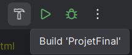
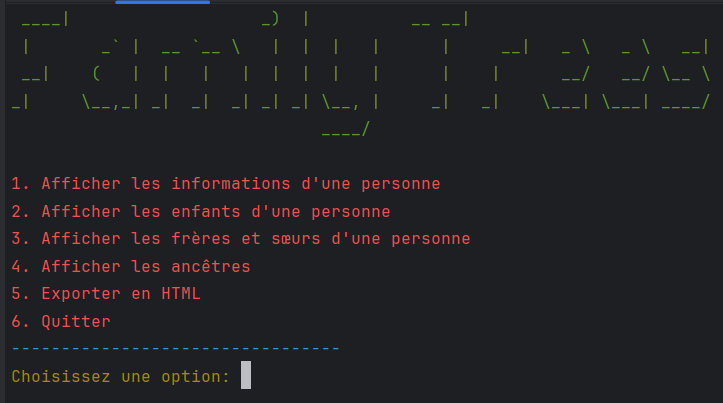
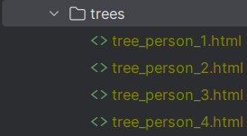
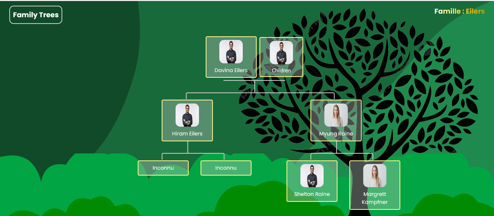

# Projet Généalogie
### L'objectif :
    
    Réaliser un arbre généalogique en c, html, css et jss.

### Point généraux

- Utilisation de struct pour les différentes informations.
- Utilisation d'allocation dynamique de mémoire.
- Utilisation des tableaux pour parcourir la population.
- Utilisation des arbres.
- Utilisation d'un script.

### Principe

    Les fonctions en C vont initialiser la population et les
    personnes à l'aide des struct. En parallele deux tamplates html on été créé
    pour le rendu web. Ces pages vont être mis à jour à partir des générations.
    
    Une fois l'abre générer, l'utilisateur pour cliqué sur chaqu'une des 
    personnes. présente sur l'arbre. Une nouvelle page web sera chargé avec 
    l'ensemble des informations de cette même personne.

    L'ensemble des données des personnes proviennent d'un fichier CSV.

### Lancement du projet

Voici les étapes importantes à faire pour pouvoir exécuter ce code
- Build le projet en cas de modification

- Se rendre dans le terminal et lancer l'exécution.

        ./start.sh
Fichier dans le dossier script.
- Rendu pour l'utilisateur :

     Il ne lui reste plus qu'à entrer un nombre en fonction de ce qu'il recherche.

### Spécificité de l'export html

    Une fois l'option 5 sélectionnée, il faut se rendre dans le dossier "trees".
    L'utilisateur ouvrira un des fichiers sur le web et pourra interagir avec 
    celui-ci.

